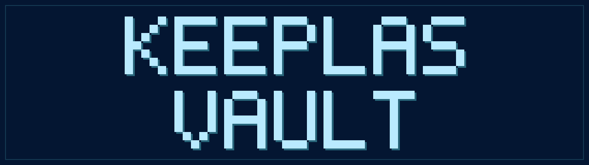

<p align="center">
  
</p>

# Keeplas Vault

<p align="center">
  <a href="https://keeplas.com/docs"></a>
  <a href="./license.md"></a>
  <a href="https://keeplas.com"></a>
  
  
</p>

> Open-source **Life Continuity Platform** — securely store, organize, and transmit vital information to trusted contacts.

Keeplas helps users protect what matters: financial assets, medical directives, legal legacy, and trusted contacts — all encrypted client-side and transmitted only under conditions the user defines. No one (not even Keeplas) can read the vault without the user's consent.

- **Continuity** — your loved ones get access to vital info if you become incapacitated or pass away.
- **Security** — zero-knowledge architecture; secrets never leave the device unencrypted.
- **Control** — you decide who accesses what, when, and under which conditions.

License: **AGPL-3.0-only** + Contributor License Agreement. Self-hostable.

---

## Stacks

**Frontend**

- **TanStack Start (Vite) + React 19** — type-safe file-based routing, runs as an SPA with a server runtime for request middleware + API routes
- **Tailwind CSS v4** + **shadcn/ui** + **Radix UI** primitives — design system (Tooltip and DatePicker still on `@base-ui/react`, migrated when touched)
- **Tiptap 3** — rich text editor for vault content
- **lucide-react** — icon set
- **cmdk** — command palette
- **Preference-based i18n** — English/French dictionaries (`en`/`fr`) with an in-app language switcher (the marketing site routes locale via URL)
- **libphonenumber-js** — phone number parsing for WhatsApp OTP
- **qrcode.react**, **html2canvas-pro**, **jspdf** — Emergency Card rendering & PDF export

**Backend**

- **[Convex](https://www.convex.dev/)** (`^1.35.1`) — realtime backend & DB, cloud or self-hosted (`CONVEX_MODE=selfhosted`)
- **Convex Auth** + **`@auth/core`** — auth foundation
- **`@simplewebauthn/{browser,server}`** — WebAuthn (Passkey) — phishing-resistant, biometric-local auth
- **WhatsApp Cloud API** — OTP secondary verification channel
- **`web-push`** — Web Push (VAPID) for the Life Check push channel
- **[Resend](https://resend.com/)** — transactional email (Life Check, OTP, contact form)

**Cryptography** (gated by CODEOWNERS in `packages/crypto/`)

- **`@noble/post-quantum`** — ML-KEM-768 (NIST FIPS 203) wraps per-recipient DEKs and Shamir shards; ML-DSA-65 (NIST FIPS 204) signs each user's ML-KEM public key for authenticated key distribution (TOFU)
- **`hash-wasm`** — Argon2id KDF for the 24-word root phrase
- **AES-GCM** (WebCrypto) + **Shamir Secret Sharing** — content encryption and social recovery
- **Vitest** — unit tests for the crypto primitives

**Tooling**

- **Turborepo + pnpm** monorepo
- **TypeScript 5**, **ESLint 9**, **Prettier**
- **Docker** (`Dockerfile.dev` + `docker-compose.yml`) for an optional containerized dev environment

## Monorepo layout

```
apps/
  web/                  TanStack Start (Vite) app (PWA-ready)
packages/
  convex/               Convex schema, queries, mutations, actions  (@keeplas/backend)
  crypto/               Zero-knowledge crypto: AES, KDF, KEM, Shamir, recovery  (RESTRICTED)
  ui/                   Shared UI components built on Radix / shadcn pattern
PRD/                    Product specs, architecture recap, design wireframes
security/               Security policy and audit material
scripts/                Maintenance scripts (env check, Convex env sync, env linking)
```

`packages/crypto/` is gated by **CODEOWNERS** — only founders can merge changes there.

## Requirements

- Node.js **>= 20**
- pnpm **>= 10** (`corepack enable` recommended)
- A Convex deployment (cloud or self-hosted) — see [Convex docs](https://docs.convex.dev)

## Quick start (native)

Run every step in order — none are optional for a first run:

```bash
# 1. One-command bootstrap: copies .env.local, installs, links per-package envs
pnpm bootstrap

# 2. Generate the audit HMAC secret, then paste it into .env.local
openssl rand -base64 32
# → set KEEPLAS_CTX_SECRET=<output> in .env.local

# 3. Provision your Convex deployment (one-time, opens a browser)
npx convex dev --once --configure=new

# 4. Seed Convex Auth's JWT keys on the deployment (REQUIRED — without this
#    the first sign-in throws "Missing environment variable JWT_PRIVATE_KEY")
npx @convex-dev/auth

# 5. Push the rest of your local env to Convex (REQUIRED — audited mutations
#    fail if KEEPLAS_CTX_SECRET doesn't match on the server)
pnpm sync:convex-env

# 6. Verify everything is in sync
pnpm check:convex          # must be green before continuing

# 7. Boot the app — Convex env check runs in the background, never blocks
pnpm dev
```

After step 7, open <http://localhost:3000>, sign in, and you're running. From then on `pnpm dev` is your only daily command.

> Whenever you edit anything under `packages/convex/`, `pnpm dev` already runs `convex dev` in parallel to regenerate types. Pre-push, `pnpm check:convex` validates the deployment env one last time.

For the full bootstrap including the auth-key chicken-and-egg dance, see [`CONTRIBUTING.md`](./CONTRIBUTING.md#first-time-setup). For the system overview, see [`docs/ARCHITECTURE.md`](./docs/ARCHITECTURE.md).

## Try it (Docker)

A containerized dev environment is provided as an alternative to a local Node install. It pins **Node 22** and **pnpm 10.8.1** to match CI, with bind-mounted source (so host edits hot-reload) and named volumes for `node_modules`, `dist/`, `.turbo/`, and `.convex/` state.

```bash
cp .env.example .env.local                      # then fill KEEPLAS_CTX_SECRET
docker compose up                               # installs + starts dev server on :3000
```

Full Docker workflow (provisioning Convex inside the container, running ad-hoc commands via `compose exec`, common gotchas, when to use Docker vs native): see [`docs/DOCKER.md`](./docs/DOCKER.md).

> The image is **`Dockerfile.dev`** — not production-ready. The web app builds with `vite build` (TanStack Start / Nitro) and can deploy to any Node host or a Nitro preset (Vercel, Netlify, Cloudflare); the backend runs on Convex Cloud. No production Dockerfile is shipped.

## Environment variables

All required variables are documented in [`.env.example`](./.env.example). High-level groups:

- **Application** — `NEXT_PUBLIC_APP_URL`, `APP_URL`, `NODE_ENV`
- **Convex** — `CONVEX_MODE` (`cloud` | `selfhosted`), `CONVEX_DEPLOYMENT`, `NEXT_PUBLIC_CONVEX_URL`, `SITE_URL`
- **WebAuthn** — `WEBAUTHN_RP_ID`, `WEBAUTHN_RP_NAME`, `WEBAUTHN_ORIGIN`
- **Audit context (required)** — `KEEPLAS_CTX_SECRET` (HMAC; the **same value** must exist in `.env.local` AND on the Convex deployment — `pnpm check:convex` enforces this)
- **Email — Resend (required for email auth)** — `RESEND_API_KEY`, `RESEND_FROM_EMAIL`; optional `SUPPORT_INBOX_EMAIL` for the contact form
- **Web Push — VAPID (optional)** — `VAPID_*`, `NEXT_PUBLIC_VAPID_PUBLIC_KEY` — Life Check push channel
- **WhatsApp — Infobip (optional)** — `INFOBIP_*`, `WHATSAPP_*_TEMPLATE_NAME` — Life Check WhatsApp channel and WhatsApp OTP verification

Two env files cover the split:

- `.env.local` — `NEXT_PUBLIC_*` vars are inlined into the client bundle by Vite at build time (see `apps/web/vite.config.ts`); server-only secrets are read from `process.env` at runtime by the request middleware (`apps/web/src/start.ts`)
- `.env.convex.local` — backend-only values that should NOT be loaded into the web process (e.g. `SITE_URL`)

> The `NEXT_PUBLIC_` prefix is kept (rather than Vite's `VITE_`) so existing references and the Convex env sync keep working unchanged after the TanStack Start migration.

Both are read by `pnpm sync:convex-env` and pushed to the Convex deployment.

Generate the audit secret with `openssl rand -base64 32`. `pnpm check:env` runs automatically before `pnpm dev` and `pnpm build` (fast, local). The slower `pnpm check:convex` (round-trips to the deployment) is manual — also fires in the background during `pnpm dev` and warns on drift without blocking.

For the full Convex workflow (provisioning, schema changes, JWT bootstrap, env sync), see [`docs/CONVEX.md`](./docs/CONVEX.md). For the Docker workflow, see [`docs/DOCKER.md`](./docs/DOCKER.md).

## Pricing

Keeplas ships with a deliberately simple two-tier model — **no monthly subscription**:

| Plan         | Price           | Storage | Highlights                                                                                                                                                                        |
| ------------ | --------------- | ------- | --------------------------------------------------------------------------------------------------------------------------------------------------------------------------------- |
| **Free**     | $0 / forever    | 100 MB  | Zero-knowledge vault, monthly Life Check, 1 emergency contact, digital Emergency Card                                                                                             |
| **Lifetime** | $199 / one-time | 10 GB   | Full Scenario Engine, 5 emergency contacts, priority Social Recovery, physical Emergency Card, video legacy messages, weekly Life Check, priority support, more storage as add-on |

Both tiers run the same zero-knowledge encryption — only the surface area changes. Switching plans never deletes your vault.

## Scripts

| Command                | Description                                                                                                   |
| ---------------------- | ------------------------------------------------------------------------------------------------------------- |
| `pnpm bootstrap`       | One-command bootstrap (`.env.local`, install, link envs, prints next steps)                                   |
| `pnpm dev`             | Run all dev servers via Turborepo. Convex env check runs in the background — never blocks boot                |
| `pnpm build`           | Production build for every workspace                                                                          |
| `pnpm lint`            | ESLint across the monorepo                                                                                    |
| `pnpm typecheck`       | TypeScript `--noEmit` across all packages                                                                     |
| `pnpm test`            | Run test suites (Vitest in `packages/crypto/`)                                                                |
| `pnpm format`          | Prettier write on `**/*.{ts,tsx,js,jsx,json,css,md}`                                                          |
| `pnpm clean`           | Remove build artifacts (`dist`, `.output`, `.turbo`)                                                          |
| `pnpm check:env`       | Validate `.env.local` is complete (runs as predev/prebuild — fast, local-only)                                |
| `pnpm check:convex`    | Validate that the Convex deployment has every required server-side var (manual, pre-push — `~30s round-trip`) |
| `pnpm sync:convex-env` | Push secrets from `.env.local` + `.env.convex.local` to the Convex deployment                                 |
| `pnpm link:env`        | Symlink `.env` files across workspaces                                                                        |

## Security model

- **Master Key**, **Recovery Phrase (24 words)**, and **Shamir shards** never leave the client unencrypted.
- The **24-word phrase** is the root crypto secret (Argon2id-derived). The **password is pure auth** and is resettable via the 24 words.
- **No OAuth.** No direct phrase recovery — trusted contacts can rebuild the master key from Shamir shards once the recovery threshold is met. Default threshold is 2 contacts; threshold 3 requires 3 ready contacts.
- Keeplas does not hold a server-side Shamir shard.
- **Authenticated key distribution (TOFU).** Each user holds an **ML-DSA-65 (FIPS 204)** identity key; their ML-KEM public key is signed with it. Clients verify the signature and pinned fingerprint before wrapping a DEK/shard to a contact — never trusting a server-provided pubkey unverified. The identity secret key is wrapped under the master key and never sent in clear.
- Sensitive auth flows enforce a **step-up gate** (login-OTP + TOTP) on top of the password; auth/onboarding/public flows are intentionally exempt.
- Per-device unlock combines **PIN**, **biometric (PRF)**, and **hardware key (PRF)** — RootKey wraps live in IndexedDB; the 24-word phrase is requested on first login per device.
- All sensitive cryptography is implemented in [`packages/crypto/`](./packages/crypto), gated by CODEOWNERS and unit-tested.

Report vulnerabilities to **security@keeplas.com** — see [SECURITY.md](./SECURITY.md). Do **not** open a public GitHub issue.

## Documentation

- [`PRD/keeplas-architecture-recap-v5.md`](./PRD/keeplas-architecture-recap-v5.md) — full architecture, security & product decisions
- [`PRD/keeplas-convex-zk-technical-v2.md`](./PRD/keeplas-convex-zk-technical-v2.md) — Convex + zero-knowledge technical spec
- [`PRD/IMPLEMENTATION_PLAN.md`](./PRD/IMPLEMENTATION_PLAN.md) — implementation roadmap
- [`PRD/Design/`](./PRD/Design) — wireframes and design tokens
- [`docs/INFOBIP_INBOUND.md`](./docs/INFOBIP_INBOUND.md) — Infobip inbound WhatsApp webhook setup (Life Check liveness)
- [`docs/TRUSTED_CONTACTS_SHARDS.md`](./docs/TRUSTED_CONTACTS_SHARDS.md) — trusted contacts, shard distribution & recovery
- [`CLAUDE.md`](./CLAUDE.md) — engineering conventions for AI assistants & humans

## Contributing

We welcome contributions! Please read:

- [CONTRIBUTING.md](./CONTRIBUTING.md) — workflow and code style
- [CONTRIBUTOR_LICENSE_AGREEMENT.md](./CONTRIBUTOR_LICENSE_AGREEMENT.md) — required CLA
- [CODE_OF_CONDUCT.md](./CODE_OF_CONDUCT.md)

Restricted areas (founder approval required): `packages/crypto/`, `security/`.

## License

Keeplas is licensed under the **GNU AGPL v3.0** — see [`license.md`](./license.md). Contributors agree to the [CLA](./CONTRIBUTOR_LICENSE_AGREEMENT.md) so the project can evolve under a sustainable governance model.
