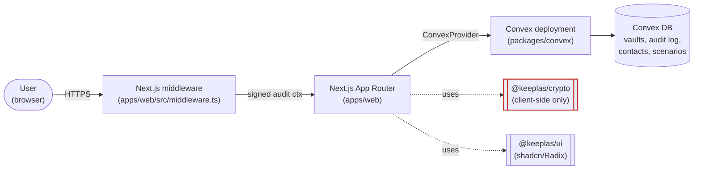

# Architecture

> System overview for contributors. For the product spec, see [`PRD/keeplas-architecture-recap-v5.md`](../PRD/keeplas-architecture-recap-v5.md); for the cryptographic protocol, see [`PRD/keeplas-convex-zk-technical-v2.md`](../PRD/keeplas-convex-zk-technical-v2.md).

## High-level view



`packages/crypto/` is **CODEOWNER-gated** — every primitive that touches the master key, recovery phrase, or Shamir shards lives there, and only the founders can merge changes to it.

## Workspaces

| Package           | Role                                                                              | Notes                                                                                                                        |
| ----------------- | --------------------------------------------------------------------------------- | ---------------------------------------------------------------------------------------------------------------------------- |
| `apps/web`        | Next.js 16 App Router. PWA-ready. The only deployed surface.                      | Hosts all UI, auth flows, vault interactions. Talks to Convex via `ConvexProvider`.                                          |
| `packages/convex` | Convex schema + queries/mutations/actions/crons.                                  | Functions live directly in `packages/convex/` (per root `convex.json`). Schema in `schema.ts`; audit envelope in `audit.ts`. |
| `packages/crypto` | Zero-knowledge primitives: AES-GCM, Argon2id, ML-KEM-768, Shamir, BIP39 recovery. | **Restricted.** All material that derives from the 24-word phrase or the master key passes through here.                     |
| `packages/ui`     | Shared shadcn/Radix design system.                                                | Imports must stay client-safe — no Convex / Next runtime deps.                                                               |

## Data-flow narrative — an audited mutation

The audit log is the keystone of compliance and is **client-attested + server-verified**. Every mutation that mutates the user's vault or contacts carries a signed envelope:

1. **Edge sign** — `apps/web/src/middleware.ts` runs on every request. It resolves the request's IP + country (via Vercel/edge headers), serializes the pair, and HMACs it with `KEEPLAS_CTX_SECRET`. The signed envelope rides along to the client as a header / cookie.
2. **Client carries** — when a mutation fires from React (`useAuditedMutation` in `apps/web/src/lib/use-audited-mutation.ts`), it reads the envelope and includes it in the mutation args.
3. **Convex verifies** — every audited mutation in `packages/convex/` calls `auditContextValidator` from `packages/convex/audit.ts`, which re-HMACs the envelope with the **same** `KEEPLAS_CTX_SECRET` (stored on the Convex deployment) and rejects on mismatch.
4. **Convex appends** — on success, the mutation appends a record to the `audit_log` table (schema: `packages/convex/schema.ts`) with the verified IP, country, user ID, action, and target.

Because the secret must match on both sides, `pnpm sync:convex-env` is the only sanctioned way to seed it on Convex. `pnpm check:convex-env` enforces equality at boot — the warning will fire silently in the background when `pnpm dev` runs (see `scripts/dev-with-convex-check.mjs`).

## Crypto boundary

Everything in `packages/crypto/` runs **in the browser only**. Convex never sees:

- the 24-word recovery phrase (Argon2id-derived root secret)
- the master key (AES-256, derived from the phrase)
- raw Shamir shards before they're wrapped with ML-KEM-768 per recipient

The server only ever stores AES-GCM ciphertexts, ML-KEM-wrapped DEKs, and ML-KEM-wrapped shards. The threat model: even a fully compromised Convex deployment cannot read user content.

See [`packages/crypto/src/`](../packages/crypto/src) for the primitives. Each subdirectory (`aes`, `kdf`, `kem`, `recovery`, `shamir`) is paired with a `__tests__/` file under `packages/crypto/__tests__/`.

## Auth bootstrap (Convex Auth)

Convex Auth (`@convex-dev/auth`) needs two env vars on the deployment to sign and verify session tokens:

- `JWKS` — public key set
- `JWT_PRIVATE_KEY` — signing key

**These are NOT auto-generated.** You seed them once per deployment with `npx @convex-dev/auth` — the CLI generates a fresh keypair and writes both values via the Convex CLI. They're deliberately omitted from `CONVEX_SYNC_KEYS` (in `scripts/_env-keys.mjs`) so a re-sync never invalidates existing sessions.

Bootstrap order:

1. `npx convex dev --once --configure=new` — provisions the deployment.
2. `npx @convex-dev/auth` — seeds `JWKS` + `JWT_PRIVATE_KEY` on the deployment.
3. `pnpm sync:convex-env` — pushes the rest of your local env (`KEEPLAS_CTX_SECRET`, WebAuthn config, Resend keys) to Convex.

After step 3, `pnpm check:convex` is green. For the full Convex workflow, see [`docs/CONVEX.md`](./CONVEX.md).

## How services connect — running locally

```
┌─────────────────────────────┐                ┌───────────────────────────┐
│   Browser (localhost:3000)  │ ◄── HTTPS ───► │  Convex deployment        │
│   • React 19 + Next.js 16   │   WebSocket    │  (convex.cloud or self-   │
│   • PWA / WebAuthn / Push   │   + REST       │   hosted)                 │
│   • packages/crypto runs    │                │  • schema.ts (database)   │
│     here, browser-only      │                │  • queries / mutations    │
└──────────┬──────────────────┘                │  • audit log table        │
           │                                   │  • Convex Auth JWT keys   │
           │ same process                      └───────────────────────────┘
           ▼
┌─────────────────────────────┐
│   Next.js dev server (host) │
│   • turbopack hot-reload    │
│   • middleware.ts signs the │
│     audit envelope (HMAC)   │
└─────────────────────────────┘
```

Three components, two processes (browser + Next.js server), one external service (Convex). The Next.js dev server runs either on your **host** (native path, `pnpm dev`) or inside the **Docker container** (compose path, `docker compose up`). Convex always runs on Convex Cloud (unless `CONVEX_MODE=selfhosted`).

**Ports**:

| Port | Service                  | Where it lives                        |
| ---- | ------------------------ | ------------------------------------- |
| 3000 | Next.js dev server (web) | host or Docker container              |
| —    | Convex backend           | `convex.cloud` (HTTPS) or self-hosted |

For the full contributor onboarding flow, see [`CONTRIBUTING.md`](../CONTRIBUTING.md). For Convex specifics (provisioning, schema changes, env sync, JWT bootstrap), see [`docs/CONVEX.md`](./CONVEX.md). For Docker (when to use it, how to attach, common gotchas), see [`docs/DOCKER.md`](./DOCKER.md).

## CI

See [`.github/workflows/ci.yml`](../.github/workflows/ci.yml). Three jobs run on every PR:

- **Lint & Typecheck** — `pnpm lint`, `pnpm typecheck`
- **Test** — `pnpm test` (Vitest, only `packages/crypto/` today; broader scaffolding in progress)
- **Security Audit** — `pnpm audit --audit-level=critical` (non-blocking)

## Known structural debt (follow-up issues)

- **`packages/convex/` monolith** — ~32 root files; should be grouped by domain (`auth`, `vault`, `contacts`, `lifecycle`).
- **`apps/web/src/components/` flat layout** — 17 files, some >20KB; needs feature subfolders.
- **No `packages/tsconfig` / `packages/eslint-config`** — config duplicated across workspaces.
- **22 `react-hooks/set-state-in-effect` warnings** — pre-existing violations of React Compiler rules; currently warn-only in `apps/web/eslint.config.mjs`.
- **Stale `packages/convex/convex/` regeneration** — `convex dev` run from `packages/convex/` defaults to a `./convex/` functions subdir, contradicting the root `convex.json`. Currently gitignored; the fix is a per-package `convex.json`.
