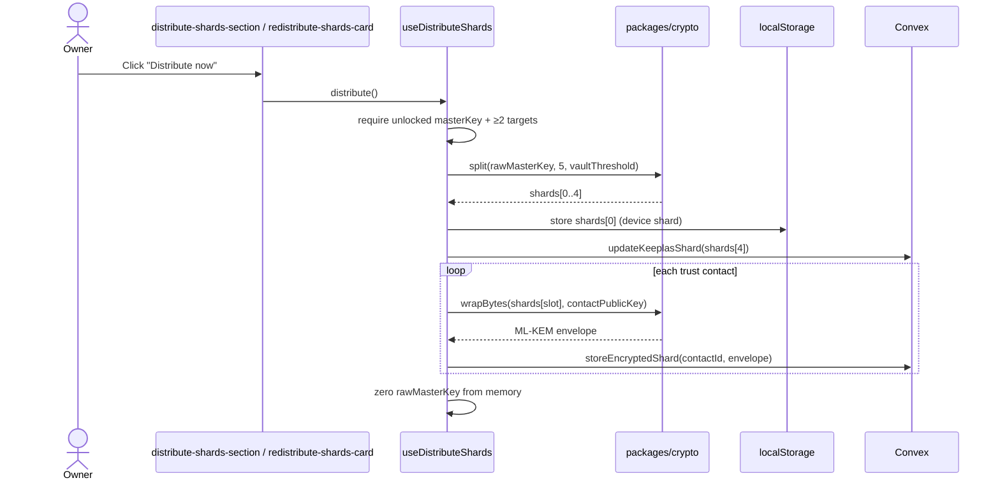
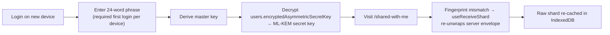

# Trusted Contacts & Distributed Shards

> How Keeplas splits a user's master key across trusted contacts and reconstructs it for
> recovery — for contributors who implement or modify the feature. For the product spec, see
> [`PRD/keeplas-architecture-recap-v5.md`](../PRD/keeplas-architecture-recap-v5.md) (§7
> Authentification & Recovery); for the cryptographic protocol, see
> [`PRD/keeplas-convex-zk-technical-v2.md`](../PRD/keeplas-convex-zk-technical-v2.md). Every
> primitive named here lives in the **CODEOWNER-gated** [`packages/crypto/`](../packages/crypto/src).

## Overview

A user's vault is encrypted under a single **master key** (AES-256, derived from the 24-word
recovery phrase via Argon2id). If that user dies or permanently loses access, the master key must
be recoverable — but **without ever trusting the server** with it.

"Distribute shards" solves this with threshold cryptography: the master key is split into 5
Shamir shares, each share is sealed to a different holder, and any `N` of them can rebuild the
key. The server only ever stores **ciphertext** — it can never read a raw share or the master key
on its own. This is the zero-knowledge contract: a fully compromised Convex deployment still
cannot reconstruct a vault.

Two things must happen for recovery to be possible, and they are deliberately separate:

1. **Distribution** (this page, §6) — the owner, while alive, splits and hands out shards.
2. **Recovery** (§10) — after the owner is confirmed unreachable, contacts pool their shards.

## Crypto building blocks

| Primitive                | Location                                    | Role                                                                                                              |
| ------------------------ | ------------------------------------------- | ----------------------------------------------------------------------------------------------------------------- |
| Shamir `split`           | `packages/crypto/src/shamir/split.ts`       | `split(secret, totalShares=5, threshold=3)` → `Uint8Array[]`. Each share = `[x-coord, ...y-values]` over GF(256). |
| Shamir `reconstruct`     | `packages/crypto/src/shamir/reconstruct.ts` | `reconstruct(shares)` → secret. Needs ≥ `threshold` shares; Lagrange interpolation over GF(256).                  |
| ML-KEM-768 `wrapBytes`   | `packages/crypto/src/kem/mlkem.ts`          | Encapsulate to a recipient's public key + AES-256-GCM the payload → one JSON envelope string.                     |
| ML-KEM-768 `unwrapBytes` | `packages/crypto/src/kem/mlkem.ts`          | Reverse of `wrapBytes`, using the recipient's ML-KEM secret key.                                                  |

The wrap envelope is self-contained JSON: `{ v, alg: "ml-kem-768+aes-256-gcm", kem, iv, ct }`
(all base64). ML-KEM-768 (NIST FIPS 203) is post-quantum and replaced RSA-OAEP.

> **Note on the threshold default.** The Shamir library defaults to `3-of-5`, but the app always
> passes the user's chosen `vaultThreshold` (constrained to **2 or 3**, default **2** — see
> `packages/convex/onboarding.ts:183`). So a freshly onboarded vault is **2-of-5** unless the user
> picked 3.

## The 5-slot split

Every distribution calls `split(rawMasterKey, 5, threshold)` and assigns the 5 shares to fixed
slots (`apps/web/src/lib/use-distribute-shards.ts:96-113`):

| Slot index  | Holder                         | Stored where                                               | Used in recovery?                          |
| ----------- | ------------------------------ | ---------------------------------------------------------- | ------------------------------------------ |
| `shards[0]` | This device                    | `localStorage` (`STORAGE_KEYS.deviceShard`)                | No — safety net for the owner's own device |
| `shards[1]` | Trust contact (`shardIndex` 2) | Server, ML-KEM-wrapped (`trusted_contacts.encryptedShard`) | **Yes**                                    |
| `shards[2]` | Trust contact (`shardIndex` 3) | Server, ML-KEM-wrapped                                     | **Yes**                                    |
| `shards[3]` | Trust contact (`shardIndex` 4) | Server, ML-KEM-wrapped                                     | **Yes**                                    |
| `shards[4]` | Keeplas custodian              | Server (`users.keeplasShard`, via `updateKeeplasShard`)    | No — safety net                            |

`shardIndex` is 1-based in the data model; the client maps it to a slot with
`slotIdx = shardIndex - 1`. The contact-driven recovery flow (§10) reconstructs from the **three
contact slots** — the device and Keeplas slots are belt-and-suspenders backups, not part of the
quorum.

## Where a shard lives (three forms)

A single logical shard exists in up to three forms at once. Never conflate them:

| Form                            | Location                                                                                                                                                                                   | Plaintext?  | Lifetime                             |
| ------------------------------- | ------------------------------------------------------------------------------------------------------------------------------------------------------------------------------------------ | ----------- | ------------------------------------ |
| **Wrapped envelope**            | Server: `trusted_contacts.encryptedShard` (+ `shardPublicKeyUsed`, `shardConfirmed`, `shardConfirmedAt`)                                                                                   | No (ML-KEM) | Durable — the source of truth        |
| **Raw shard (cache)**           | Contact's device: IndexedDB `keeplas-recovery-shards`, store `shards`, keyed by owner `userId` (`apps/web/src/lib/recovery-shard-store.ts`)                                                | Yes         | Disposable cache — rebuilt on demand |
| **Contact's ML-KEM secret key** | Server: `users.encryptedAsymmetricSecretKey`, AES-GCM-encrypted **under the contact's own master key** (`apps/web/src/lib/use-recipient-crypto.ts:66-82`); public key in `users.publicKey` | No          | Durable                              |

The key insight: the raw shard cache is **not** the only copy. The wrapped envelope lives on the
server, and the contact's secret key is recoverable on any device from their own 24-word phrase —
so the raw shard can always be re-derived (§8).

## Distribution flow (owner side)

Entry points (both call the same `useDistributeShards` hook):

- `/trusted-contacts` — `apps/web/src/app/(dashboard)/trusted-contacts/distribute-shards-section.tsx`
  (contextual card; appears when a contact is missing a current shard).
- `/settings` → Security Center — `apps/web/src/app/(dashboard)/settings/sections/redistribute-shards-card.tsx`
  (always-visible, on-demand re-distribution).

Eligible targets come from `getDistributionTargets` (`packages/convex/trusted_contacts.ts`):
accepted **trust** contacts that have published a `contactPublicKey` and have a `shardIndex`.
Both the client (`MIN_TRUST_CONTACTS_FOR_RECOVERY = 2`) and the backend (`storeEncryptedShard`)
refuse to distribute below 2 trust contacts — a lone guardian is a broken, quorum-unreachable
setup.



`storeEncryptedShard` sets `shardConfirmed: true` / `shardConfirmedAt`, and on the **first**
distribution to a contact sends them an in-app + email notification ("You now safeguard a recovery
shard"). Re-distributions are silent — the contact picks up the new envelope automatically (§7).

## Receiving a shard (contact side)

When a contact opens `/shared-with-me`, `useReceiveShard`
(`apps/web/src/app/(dashboard)/shared-with-me/use-receive-shard.ts`) reconciles every vault that
names them as a trust contact:

1. Compute `envelopeFingerprint(encryptedShard)` (SHA-256 → first 8 bytes, 16 hex chars).
2. If the local IndexedDB copy is missing or its `envelopeHash` differs, surface a brief
   "restoring" state, then `unwrapBytes(envelope, secretKey)` and `putStoredShard(...)`.
3. On a successful unwrap, call `confirmShardVerified` once per session per envelope to stamp
   `lastVerifiedAt` (a stronger proof than the round-trip verification envelope).

The unwrap is idempotent: rows whose fingerprint already matches the local copy are skipped.

## Device change / multi-device

The raw shard in IndexedDB does **not** survive a device change — and that's fine, because it's
only a cache. On a new device the contact recovers it transparently:



The same fingerprint mechanism also handles the case where the **owner re-distributed** while the
contact was offline: the server envelope changed, the cached fingerprint no longer matches, and
the shard is silently re-unwrapped.

> **The one unrecoverable case:** a contact who loses **both** their device **and** their 24-word
> phrase can no longer derive their ML-KEM secret key, so their shard is gone. The `N`-of-5
> threshold absorbs this — recovery still succeeds as long as `N` contacts remain functional.

## Re-distribution / reset

There is no separate "reset" — **clicking "Distribute now" again is the reset.** Each call
re-splits the master key with the current threshold, producing a brand-new polynomial, so **every
previously distributed shard is cryptographically invalidated by design** (see the comment in
`apps/web/src/lib/use-distribute-shards.ts:35-40`). The threshold is the contract, not a
per-contact setting.

Re-distribute after:

- a **threshold change** (`vaultThreshold` updated → all shards invalid),
- onboarding a **new or replacement guardian**,
- periodic **hygiene rotation**.

Note: `revokeContact` clears a contact's `encryptedShard` and resets `shardConfirmed`, but does
**not** auto re-distribute. To rebalance slots after a revocation, the owner re-runs distribution.

## Recovery / quorum flow

Recovery is contact-driven, gated by the Life Check, and zero-knowledge end to end. Backend lives
in `packages/convex/access_requests.ts`; the client side is
`apps/web/src/app/(dashboard)/shared-with-me/use-recovery-flow.ts`.

```mermaid
sequenceDiagram
    participant LifeCheck as Life Check
    actor Contacts as Trust contacts
    participant Convex as access_requests
    actor Owner
    participant Client as use-recovery-flow

    LifeCheck->>Convex: cycle status = awaiting_confirmation
    loop each confirming contact
        Contacts->>Convex: markUserUnreachable(contactId)
    end
    Convex->>Convex: quorum when contactsInitiated ≥ confirmationThreshold (default 2)
    Convex-->>Owner: "Emergency access initiated — 72h to cancel"
    opt owner is alive
        Owner->>Convex: cancelEmergencyAccess (resets state)
    end
    Note over Convex: after 72h grace expires
    loop each contact
        Client->>Convex: getRecoveryPeers(contactId)
        Client->>Client: unwrap own raw shard; wrapBytes(shard, eachPeerPublicKey)
        Client->>Convex: submitRecoveryShards(envelopes per peer)
    end
    Client->>Convex: getRecoveryShardsForMe(accessRequestId, contactId)
    Client->>Client: unwrapBytes(each) + own shard → reconstruct(shares)
    Client-->>Contacts: master key bytes (on-device only)
```

Each contact **cross-wraps** their share to every peer's public key, so once enough contacts have
submitted, any one of them can gather `threshold` shares (their own + the peers' copies wrapped to
them) and reconstruct the master key **on their own device**. The server stores only the wrapped
envelopes in `recovery_shard_submissions`; it never sees a raw share.

Relevant `access_requests.ts` functions:

| Function                           | Caller          | Purpose                                                                   |
| ---------------------------------- | --------------- | ------------------------------------------------------------------------- |
| `markUserUnreachable`              | Trust contact   | Confirm unreachability; builds quorum, opens 72h grace, schedules release |
| `cancelEmergencyAccess`            | Vault owner     | "I'm alive" — cancels during grace                                        |
| `getActiveAccessRequestForContact` | Trust contact   | Whether to surface "Submit my shard"                                      |
| `getRecoveryPeers`                 | Trust contact   | Other trust contacts + their public keys (for cross-wrapping)             |
| `submitRecoveryShards`             | Trust contact   | Upload per-peer wrapped envelopes (gated on quorum + grace expiry)        |
| `getRecoveryShardsForMe`           | Trust contact   | Envelopes addressed to the caller, to unwrap and reconstruct              |
| `getRecoverySubmissionCount`       | Owner / contact | Distinct submitter count for "X of Y" UI                                  |

## Security invariants

- Raw Shamir shares and the master key **never leave the device** in plaintext.
- The server stores only ML-KEM envelopes (`encryptedShard`, recovery submissions) and AES-GCM
  ciphertexts (`encryptedAsymmetricSecretKey`).
- Reconstruction happens **on a contact's device**, never server-side.
- Recovery requires an explicit **human gate** (unreachability quorum) **plus** a 72h
  owner-cancellable grace window — it cannot be triggered silently.
- Distribution is refused below 2 trust contacts, on both client and server.

See [`docs/TESTING-STRATEGY.md`](./TESTING-STRATEGY.md) for the shard-distribution test coverage
(invite → accept → distribute → resubmit; assert no shard is ever readable in plaintext).

## Key files reference

| Concern                                  | File                                                                                    |
| ---------------------------------------- | --------------------------------------------------------------------------------------- |
| Split + 5-slot fan-out                   | `apps/web/src/lib/use-distribute-shards.ts`                                             |
| Distribution UI (contacts)               | `apps/web/src/app/(dashboard)/trusted-contacts/distribute-shards-section.tsx`           |
| Distribution UI (settings)               | `apps/web/src/app/(dashboard)/settings/sections/redistribute-shards-card.tsx`           |
| Server: store/eligibility                | `packages/convex/trusted_contacts.ts` (`storeEncryptedShard`, `getDistributionTargets`) |
| Local raw-shard cache                    | `apps/web/src/lib/recovery-shard-store.ts`                                              |
| Receive / re-cache                       | `apps/web/src/app/(dashboard)/shared-with-me/use-receive-shard.ts`                      |
| ML-KEM keypair (secret-under-master-key) | `apps/web/src/lib/use-recipient-crypto.ts`                                              |
| Recovery flow (client)                   | `apps/web/src/app/(dashboard)/shared-with-me/use-recovery-flow.ts`                      |
| Recovery / quorum (server)               | `packages/convex/access_requests.ts`                                                    |
| Shamir + ML-KEM primitives               | `packages/crypto/src/shamir/`, `packages/crypto/src/kem/mlkem.ts`                       |

## See also

- [`docs/ARCHITECTURE.md`](./ARCHITECTURE.md) — crypto boundary and workspace layout
- [`docs/TESTING-STRATEGY.md`](./TESTING-STRATEGY.md) — shard-distribution test coverage
- [`PRD/keeplas-architecture-recap-v5.md`](../PRD/keeplas-architecture-recap-v5.md) — §7 recovery product decisions
- [`PRD/keeplas-convex-zk-technical-v2.md`](../PRD/keeplas-convex-zk-technical-v2.md) — zero-knowledge protocol
